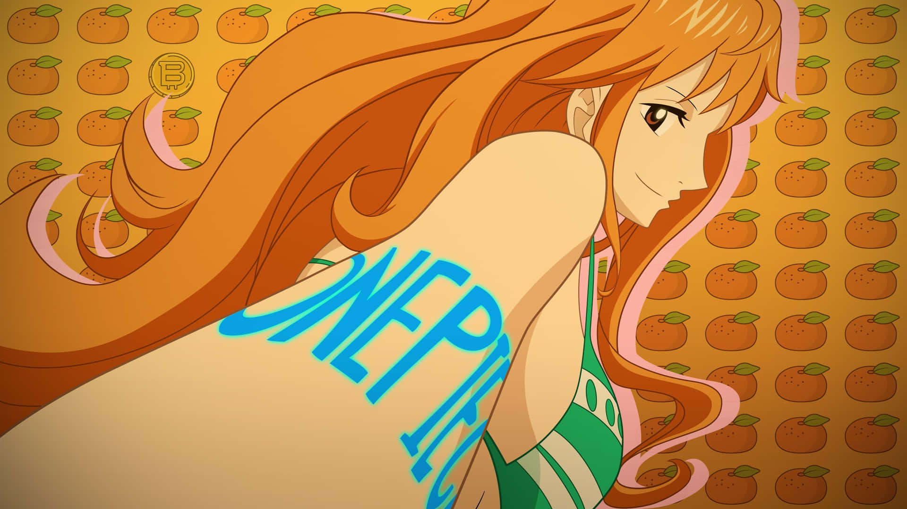

  
  
   

  

 

<table width="100%" style="border: none;">
  <tr>
    <td width="65%" valign="top">
      <h2>🗺️ Bitácora de Viaje</h2>
      
Soy un desarrollador freelance y estudiante de ingeniería trazando mi propia ruta en el Grand Line del código. Me especializo en construir soluciones desde la base de datos hasta la interfaz, asegurando que cada proyecto navegue sin problemas.

      <ul>
        <li>🍊 <b>Rol:</b> Navegante Fullstack</li>
        <li>🧭 <b>Especialidad:</b> Sitios dinámicos, automatización y bases de datos.</li>
        <li>🏴‍☠️ <b>Misión actual:</b> Expandir mi arsenal tecnológico.</li>
      </ul>
    </td>
    <td width="35%" align="center" valign="center">
      <h2>🤝 Den Den Mushi</h2>
      
<i>(Redes y Contacto)</i>

      
        
      
    </td>
  </tr>
</table>

 
 

<h2 align="center">⚡ Log Pose: Arsenal Tecnológico</h2>

  
<b>Cartografía Frontend</b>

  
  
  
    
  
  
<b>Navegación Backend & Datos</b>

  
  
  

 
 

<h2>💰 Carteles de Recompensa (Proyectos Destacados)</h2>
<table width="100%" style="border: none;">
  <tr>
    <td width="50%" align="center" valign="top">
      <h3>🖥️ Desarrollo Web Fullstack</h3>
      
<i>Sistemas a Medida</i>

      
Creación de interfaces dinámicas y diseño de arquitecturas de bases de datos relacionales enfocadas en rendimiento, seguridad y gestión de usuarios.

    </td>
    <td width="50%" align="center" valign="top">
      <h3>🤖 Automatización LLM</h3>
      
<i>Procesamiento de Lenguaje</i>

      
Workflows en Python para automatizar el procesamiento y traducción de archivos utilizando modelos locales a través de Ollama.

    </td>
  </tr>
</table>

 
 

<h2 align="center">☁️ Radar del Clima (GitHub Stats)</h2>

  
  
  

